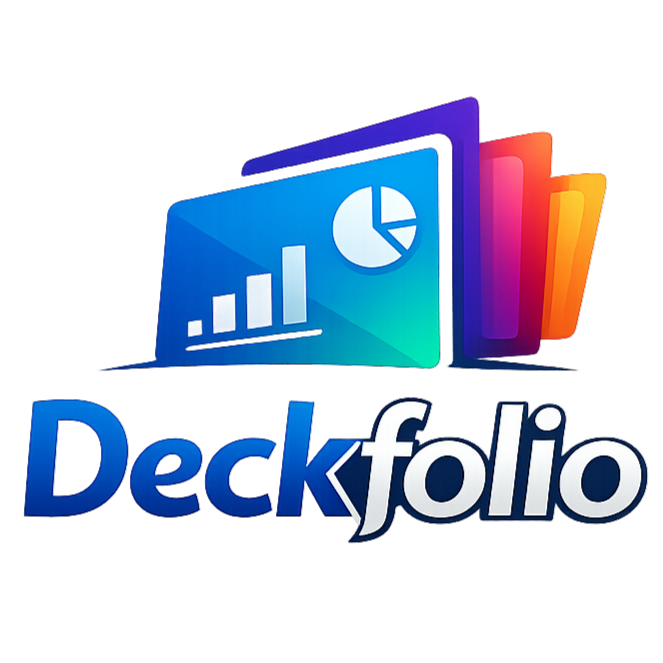

# 🗂️ Deckfolio — Professional Presentation Showcase

<div align="center">
  
  <h3>A recruiter-ready gallery for flagship project decks and internal innovations.</h3>
  
  [](https://nextjs.org/)
  [](https://tailwindcss.com/)
  [](https://www.typescriptlang.org/)
  [](https://react.dev/)
</div>

---

## 🚀 Overview

**Deckfolio** is a high-performance, visually polished portfolio designed to showcase presentation decks for juries, recruiters, and stakeholders. Originally built to house **Smart India Hackathon (SIH)** finalist decks, it provides a centralized, interactive interface for navigating complex project narratives through clean metadata and direct document access.

### ✨ Key Features

- **📱 Responsive Glassmorphism**: A sleek, modern UI with backdrop blurs and subtle gradients powered by Tailwind CSS v4.
- **🌓 Adaptive Theming**: Full support for Light and Dark modes with seamless transitions via `next-themes`.
- **📊 Metric-Driven Hero**: Instant visibility into portfolio reach with automated stat tracking for deck counts and focus areas.
- **🧩 Managed Collections**: Categorized sections for National-Level Finalists, Internal builds, and Academic presentations.
- **⚡ Performance First**: Leveraging Next.js 16 App Router for lightning-fast navigation and optimized asset delivery.

---

## 🛠️ Tech Stack

- **Framework**: [Next.js 16](https://nextjs.org/) (App Router)
- **Library**: [React 19](https://react.dev/)
- **Styling**: [Tailwind CSS v4](https://tailwindcss.com/)
- **Language**: [TypeScript](https://www.typescriptlang.org/)
- **Theme Management**: [next-themes](https://github.com/pacocoursey/next-themes)
- **Animations**: CSS Transitions & Framer Motion (future)

---

## 📂 Project Structure

```text
├── public/
│   ├── decks/          # PDF/PPT exports of your decks
│   └── deckfolio.png   # Brand identity assets
├── src/
│   ├── app/
│   │   ├── globals.css # Tailwind v4 config & brand variables
│   │   ├── layout.tsx  # Root layout with ThemeProvider
│   │   └── page.tsx    # Main dashboard & content model
│   └── components/     # Reusable UI components (Theme toggle, etc.)
└── package.json        # Dependencies & scripts
```

---

## 🚀 Getting Started

### 1. Installation
Clone the repository and install dependencies:
```bash
npm install
```

### 2. Development
Start the local development server:
```bash
npm run dev
```
Visit `http://localhost:3000` to see the magic.

### 3. Build
Generate a production-ready build:
```bash
npm run build
```

---

## ✍️ Customizing Content

Deckfolio is designed to be easily extensible. To add your own presentations:

1.  **Add Assets**: Drop your `.pdf` or `.pptx` files into [public/decks/](public/decks/).
2.  **Update Data**: Open [src/app/page.tsx](src/app/page.tsx) and locate the `deckCollections` array.
3.  **Add a Deck Object**:
    ```typescript
    {
      title: "Your Awesome Project",
      summary: "A brief 2-sentence hook about the impact.",
      badge: "Competition Name",
      tag: "Category · Year",
      meta: [
        { label: "Highlight", value: "Key achievement or metric" },
        { label: "Tech Stack", value: "Next.js · AI · Python" }
      ],
      primaryLink: { href: "/decks/your-filename.pdf", label: "View Deck" },
      secondaryLink: { href: "https://github.com/your-repo", label: "GitHub" }
    }
    ```

---

## 📥 Contact & Collaboration

Have a question about the finalist decks or want to collaborate on a case study?

- **Email**: [anish@example.com](mailto:anish@example.com)
- **Project Repository**: [GitHub](https://github.com/Anish-2005)

---
<p align="center">Built with 💻 and ☕ by Anish · 2026</p>
